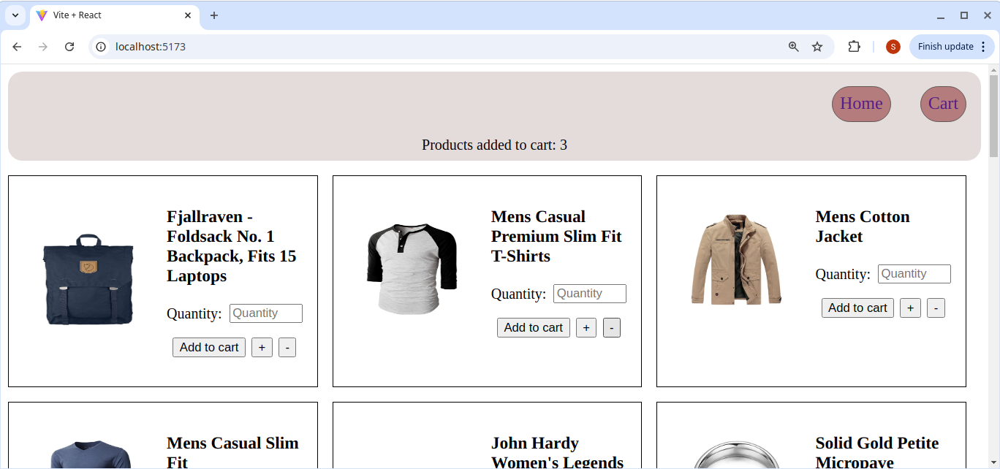
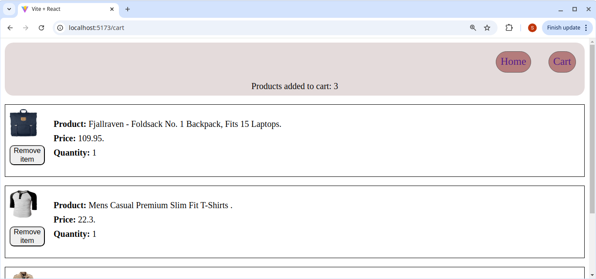
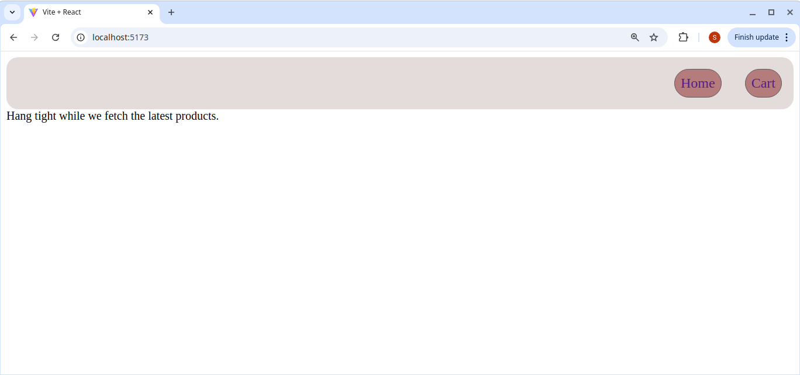
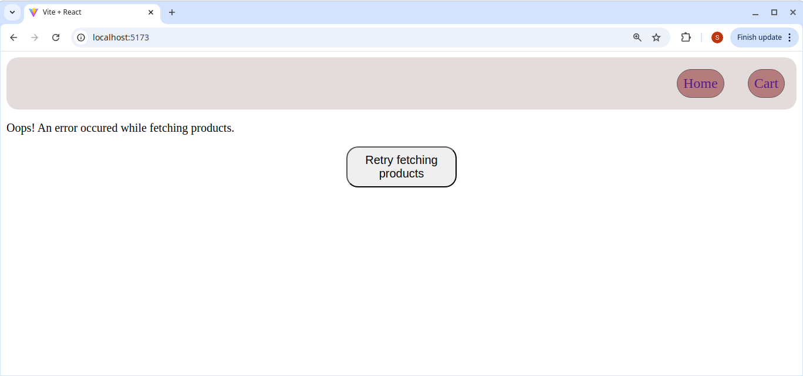

# Shopping Cart

## Table of contents
- [Introduction](#introduction)
- [Screenshots](#screenshots)
- [Features](#features)
- [Concepts Applied](#concepts-applied)
- [Tech Stack](#tech-stack)
- [Getting Started](#getting-started)
- [Running Tests](#running-tests)
- [Folder Structure](#folder-structure)
- [Future Improvements](#future-improvements)
- [Author](#author)
- [Acknowledgement](#acknowledgement)

## Introduction
A sleek, mobile-first mock shopping cart built with React which is part of [The Odin Project](https://www.theodinproject.com/) React curriculum. This project demonstrates a full React stack: API data fetching, routing, state management, component architecture, and testing.

[🚀 Live Preview](https://shopping-cart-9s8wxi2tu-stephen-mark-asembos-projects.vercel.app/) | [📂 View Source Code](https://github.com/Stephenasembo/shopping-cart)

---

## Screenshots

### Homepage


### Cart page


### Loading screen


### Data fetching error page

---

## Features

- **Routing** via `react-router-dom` — includes homepage and shop page.
- **Fake Store API Integration** — fetches real product data.
- **Cart Functionality** — add/remove items, live quantity updates.
- **Mobile-First Design** — responsive from ground up.
- **Component-based architecture** — modular and maintainable.
- **React Testing Library** — functional unit and integration tests.
- **State Management** — via React context and component state.
- **Styled with CSS Modules**

---

## Concepts Applied

- React fundamentals (components, props, state, effects).
- React Router (v6).
- Async data fetching with `useEffect`.
- Lifting state up & component composition.
- Controlled inputs and user interaction handling.
- Testing with Jest & React Testing Library.
- Responsive/mobile-first design principles.
- Vercel SPA configuration with `vercel.json`.
- Git best practices with meaningful commits.

---

## Tech Stack

| Tech                                                                               | Purpose            |
| ---------------------------------------------------------------------------------- | ------------------ |
| [React](https://reactjs.org/)                                                      | Frontend framework |
| [React Router](https://reactrouter.com/)                                           | Navigation         |
| [FakeStore API](https://fakestoreapi.com/)                                         | Product data       |
| [Jest](https://jestjs.io/) + [React Testing Library](https://testing-library.com/) | Testing            |
| [Vercel](https://vercel.com/)                                                      | Deployment         |
| CSS Modules                                                                        | Styling            |

---

## Getting Started

```bash
git clone https://github.com/Stephenasembo/shopping-cart
cd shopping-cart
npm install
npm run dev
```

> **Live version hosted on [Vercel](https://vercel.com/)**
> Includes `vercel.json` for proper SPA routing.

---

## Running Tests

```bash
npm run test
```

---

## Folder Structure

```
src/
├── components/             # Reusable UI components
├── styles/                 # CSS styling modules
├── App.test.jsx            # Unit and integration tests
├── Layout.jsx              # Context provider to pages
├── App.jsx                 # Home page
└── main.jsx                # Routing Implementation
```

---

## Future Improvements
- Replace prop drilling with Context API
- Introduce state reducer for advanced state management
- Memoize product price calculations for performance
- Enhance UI with animations (e.g., cart transitions)
---

## Author

**Stephen Asembo**
[GitHub @Stephenasembo](https://github.com/Stephenasembo)

---

## Acknowledgement

This project is open source and part of [The Odin Project](https://www.theodinproject.com/).
